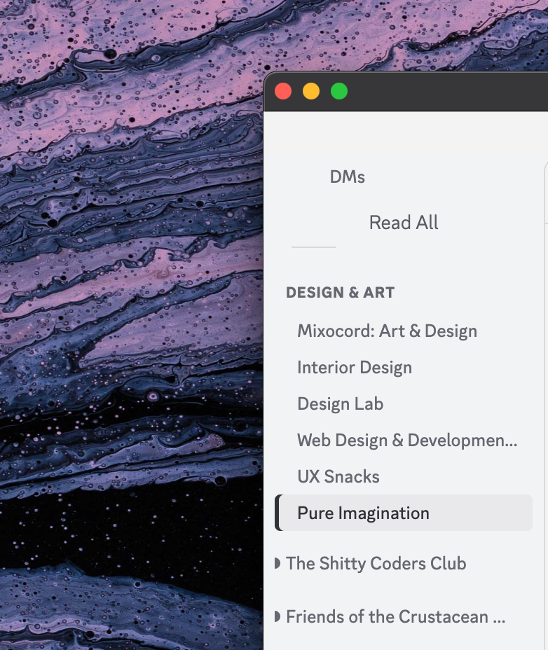

# Guild Text List

[Shelter](https://shelter.uwu.network/) plugin that replaces Discord's server icon sidebar with a text list.

<p align="center"></p>

## Install

1. Open **Shelter Settings** → click **+** (Add Plugin)
2. Turn **off** the "Local plugin" toggle
3. Paste the URL:
   ```
   https://raw.githubusercontent.com/fabiogaliano/guild-text-list/gh-pages/guild-text-list/
   ```
4. Click **Add**

## Development

```bash
bun install
bunx lune dev plugins/guild-text-list
```

Then enable **Lune Dev Mode** in shelter settings.

## License

MIT
